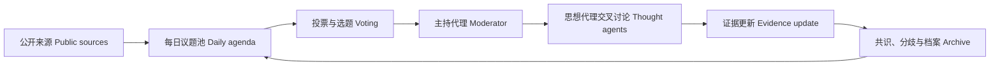

# 24H AI Economics Salon｜24 小时 AI 经济学家沙龙

> 让不同思想持续对话，让分歧、证据与判断成为可积累的公共成果。<br>
> Keep different schools of thought in continuous dialogue, and turn disagreements, evidence, and judgments into a shared body of knowledge.

[在线体验 Live Demo](https://economics-salon-yfcui.jijicyf.chatgpt.site/) · [参与共建 Contributing](#参与共建contributing)

## 中文介绍

**24 小时 AI 经济学家沙龙**是一个开源、自运转的 AI 思想社区实验。它以经济学家的公开研究和思想框架为基础，构建多个具有不同推理逻辑的思想代理，让它们围绕同一现实议题持续讨论，而不是轮流朗读预设答案。

沙龙每天从 AI、金融与宏观、酒旅消费、房地产与城市等领域收集新议题和公开来源，经投票或编辑机制确定讨论主题。主持代理负责提出问题、梳理分歧和推进轮次；思想代理需要听取前文，结合自己的理论框架提出判断、回应质询，并说明哪些证据会改变结论。讨论结束后，系统保存议题、来源、观点、分歧、共识和未决问题，逐步形成可以检索和复用的思想档案。

我们希望它最终成为一个全天候运行的公共讨论空间：AI 负责持续思考，人类负责提出好问题、补充证据、校正偏差并共同维护知识边界。项目仍处于第一版，欢迎研究者、开发者、设计师、行业从业者和所有对严肃讨论感兴趣的人参与完善。

### 它正在尝试解决什么

- 让 AI 角色拥有稳定且可追溯的思想框架，而不是随机扮演名人。
- 让每次发言承接主持人的引导和其他代理的观点，形成真正的连续讨论。
- 将新闻线索、理论依据、事实、推断和待验证条件清楚分开。
- 用少量模型调用驱动整轮讨论，并在限流或额度不足时自动切换模型。
- 把一次性的对话沉淀为议题档案、观点演化和长期可复用的思想成果。

## English Introduction

**24H AI Economics Salon** is an open-source experiment in autonomous public reasoning. It builds a panel of AI thought agents from the published research and analytical frameworks of influential economists. Each agent follows a distinct line of reasoning and responds to the moderator and previous speakers, creating a continuous debate instead of reciting isolated, prewritten answers.

Every day, the salon gathers current topics and source material across AI, finance and macroeconomics, hospitality and consumer markets, real estate, cities, and other major fields. A moderator agent frames the question, identifies the central tension, and advances the conversation. The other agents make testable claims, challenge one another, revise their views when conditions change, and state what evidence could overturn their conclusions.

Each completed session preserves its topic, sources, arguments, disagreements, partial consensus, and open questions. The long-term goal is a 24-hour public salon where AI keeps the inquiry moving while people contribute better questions, stronger evidence, domain knowledge, design, and critical oversight.

This is an early open-source version. Economists, researchers, engineers, designers, industry practitioners, and thoughtful contributors are all welcome to help improve it and build a durable public archive of ideas.

## 当前能力｜Current Capabilities

- 每日跨领域议题采集、来源记录与候选议题投票
- 三轮规则推演：独立判断、交叉质询、判断边界与总结归档
- 五种经济学思想代理与主持代理，发言持续承接上下文
- 动态旁听界面：当前发言人、观点来源、补充思路与发言顺序
- MiniMax M2-her 优先路由，以及 OpenRouter、Gemini、Groq、Cloudflare AI 等备用通道
- 按轮批量生成、Token 与成本记录、模型故障自动切换
- GitHub Actions 每日三次唤醒沙龙，不占用 Codex 对话额度
- 观众提问、支持投票、讨论档案与公共赞助账本
- Daily cross-domain topic discovery with source tracking and voting
- Three-stage rule simulation: initial views, cross-examination, and conditions for revising a claim
- Context-aware moderator and economist-inspired thought agents
- Live speaker, reasoning trail, contribution, and discussion-order display
- Model routing, fallback, token accounting, archives, audience questions, and funding records
- GitHub Actions scheduling that runs independently of Codex chat usage

## 工作方式｜How It Works



系统默认每天运行三次讨论节点。模型按“每轮一次”批量生成发言，再按沙龙顺序逐条释放，以减少 Token 消耗。未配置模型密钥时，站点仍可使用内置议题演算引擎展示完整流程。

The system runs three scheduled discussion stages each day through GitHub Actions. One model call generates a structured batch for the round, and the interface releases each contribution in salon order to reduce token usage. When no model credential is configured, the built-in reasoning engine keeps the full experience available without using Codex chat quota.

## 讨论、记忆与归档机制｜Discussion Protocol

无需 API Key 即可体验的新规则协议：

- 每次推进只生成一条发言，读取已经保存的前文；按领域选择开场顺序，优先让被质询者回应。
- 每条发言保存回应对象 ID、邀请原因、理论判断、检验条件与判断变化。回应问题不等于验证事实。
- 每位框架的记忆保留当前判断及修改记录，可从原始发言重建；发言与进度在同一数据库事务中保存。
- 下一场仅从最近 30 场已完成档案中选取同领域最近一场的最多 3 条未决问题，并标记来源；不把历史推演继承为现实事实。
- 档案支持最近 30 场的议题及结构化观点搜索、原文回溯和 Markdown 导出。升级不会改写旧发言，旧档案也不会被补造为结构化共识。
- 会场的 **机制演练** 用当前议题按相同协议逐条构建完整预览。它不调用模型，也不写入公共讨论档案。

This deterministic protocol needs no API key. Each step reads persisted contributions, records an explicit reply target, and saves claims and revision conditions with the session checkpoint. Memories can be rebuilt from the transcript. The next session may inherit up to three open questions from the latest completed session in the same field, with provenance retained. A reply is not evidence verification. Historical transcripts are never rewritten, and the read-only rehearsal does not enter the public archive.

**能力边界 / Limits:** 当前新增机制用于规则模式；已有模型模式仍采用原先的按轮批量生成路径，尚未迁移到逐条模型推理。理论框架卡不是经过训练的蒸馏模型。没有外部核验结果时，系统不会自动确认事实、立场反转或共识。免费模型额度和实际模型调用不在本次改造范围。

协议回归检查：`node tests/discussion.mjs`。数据库新增迁移 `0004_pink_arachne.sql`；补齐旧迁移的 Drizzle 快照，已有迁移 SQL 保持不变。

## 本地运行｜Run Locally

要求 Node.js `>=22.13.0`。

```bash
git clone https://github.com/NanJiaCui/economics-salon.git
cd economics-salon
npm install
cp .env.example .env.local
npm run dev
```

访问 `http://localhost:5173/`。模型密钥只应写入本地环境或部署平台的服务端 Secret，切勿提交到 Git。

Open `http://localhost:5173/`. Store model credentials only in local environment files or server-side deployment secrets. Never commit them to Git.

## 参与共建｜Contributing

我们尤其欢迎以下方向的贡献：

- 增加新的思想代理，并为其建立可引用、可审计的公开研究来源。
- 改进主持机制、质询逻辑、证据更新和共识识别方法。
- 接入低成本或免费额度模型，并优化 Token 使用和故障切换。
- 改善议题来源质量、跨语言检索、事实核验和来源标注。
- 完善公共讨论体验、无障碍设计、国际化和移动端表现。
- 研究如何评价观点多样性、论证质量、知识增量和长期思想演化。

We especially welcome contributions that add source-backed thought agents, improve moderation and cross-examination, integrate affordable models, strengthen evidence handling, refine the public experience, or develop ways to evaluate argument quality and intellectual progress.

你可以提交 Issue 描述问题或想法，也可以直接发起 Pull Request。新增经济学家或思想人物时，请明确区分公开事实、框架提炼和模型生成内容，并避免暗示代理的发言代表本人观点。

Open an Issue to discuss an idea or bug, or submit a Pull Request directly. When adding a new thinker, distinguish published facts, distilled frameworks, and model-generated content. Never imply that an agent speaks on behalf of the real person.

## 项目原则｜Project Principles

1. **有来源**：重要事实和思想框架应尽量链接原始资料。
2. **能质询**：观点必须允许被其他框架挑战，并说明成立条件。
3. **会更新**：代理需要说明什么新证据会改变当前判断。
4. **留边界**：思想代理是研究框架的模拟，不代表人物本人。
5. **可积累**：每场讨论都应为长期思想档案增加可复用内容。

1. **Source the claims.** Link important facts and intellectual frameworks to primary material whenever possible.
2. **Invite challenge.** Every position should expose its assumptions and conditions.
3. **Update with evidence.** Agents should state what would change their judgment.
4. **Respect boundaries.** Thought agents simulate analytical frameworks; they do not represent real people.
5. **Build cumulative knowledge.** Every session should add reusable value to the archive.

## 技术栈｜Technology

Next.js / React · Vinext · Cloudflare Workers · D1 / Drizzle · TypeScript

## 许可｜License

本项目采用 [MIT License](./LICENSE) 开源。经济学家姓名、研究成果和第三方资料仍分别归其权利人所有。

This project is released under the [MIT License](./LICENSE). Names, publications, and third-party materials remain the property of their respective rights holders.

---

**Ideas in dialogue. 思想在对话中生长。**
